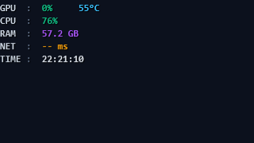
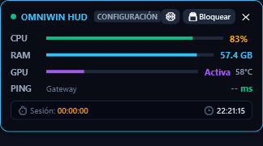
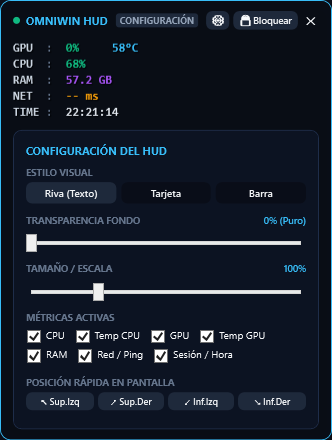
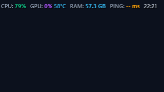
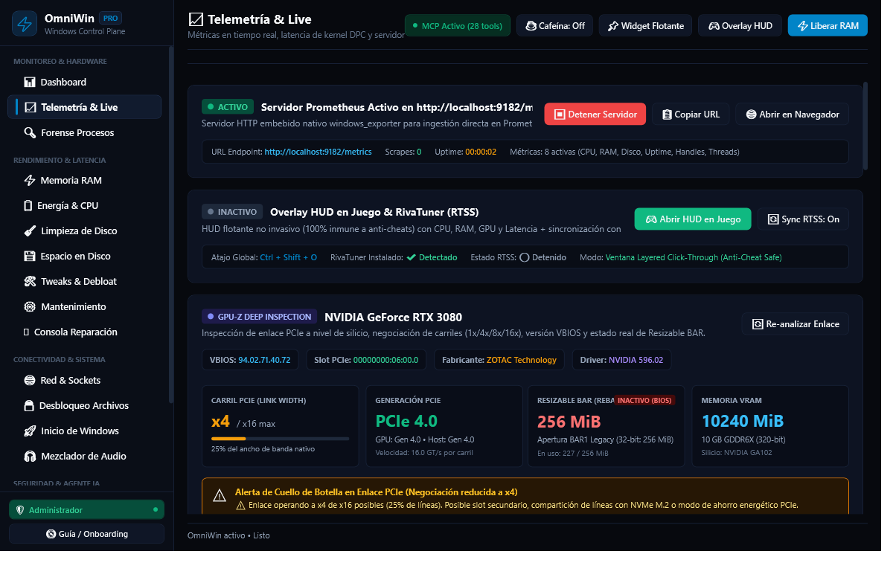
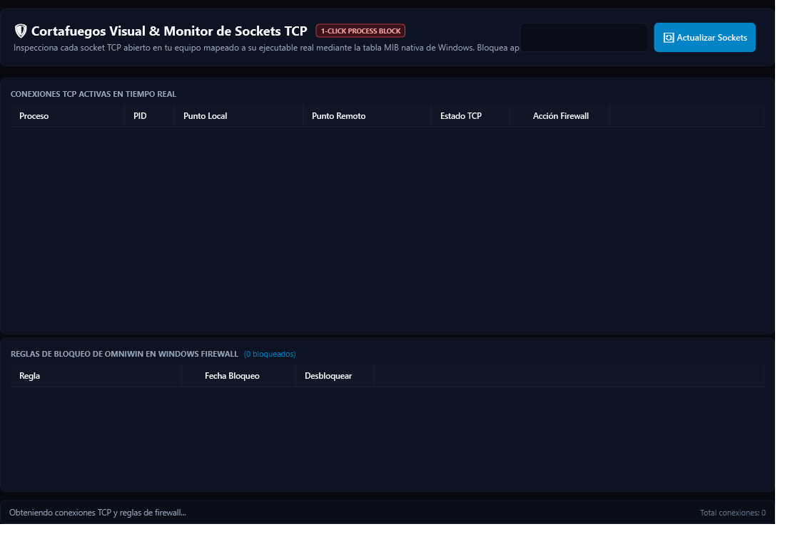

# OmniWin — Windows Deep Control Plane, Optimizer & MCP Agent Platform

[](https://dotnet.microsoft.com/)
[](https://learn.microsoft.com/en-us/dotnet/csharp/)
[](https://learn.microsoft.com/en-us/dotnet/desktop/wpf/)
[](https://modelcontextprotocol.io/)
[-brightgreen)](docs/E2E_VM_TESTING_GUIDE.md)
[-blue)](OmniWin.UI/Views/GamingOverlayWindow.xaml.cs)
[](LICENSE)

> **OmniWin** is a native, ultra-high-performance Windows 10 and Windows 11 (24H2 / 25H2 / 26H1) engineering, gaming optimization, and observability control plane written in compiled C# (.NET 9) with direct Win32 & NT Kernel API integrations.
> It replaces 8+ separate fragmented utilities (*HWMonitor, Process Hacker, Autoruns, FanControl, CCleaner, RTSS OSD, Simplewall, IObit Unlocker, EarTrumpet*) into a single zero-bloat standalone executable, backed by a 35-tool **Model Context Protocol (MCP)** server for autonomous AI agents.

---

## 🌟 Key Architecture & Capabilities

### 1. ⚡ NT Kernel Memory Management (`MemoryService`)
* **Atomic RAM Purge**: Leverages `NtSetSystemInformation` with `SYSTEM_MEMORY_LIST_COMMAND` to flush:
  * Modified Page List
  * Standby Priority Lists (0 to 7)
  * System Cache and Working Sets (when explicitly requested)
* **Non-Destructive by Default**: Defaults to safe standby list flushing and preserves application working sets during active game launches to prevent cold page faults and startup stuttering.

### 2. 🔓 Windows Restart Manager File Unlocker (`FileLockService`)
* Direct integration with `rstrtmgr.dll` (`RmStartSession`, `RmRegisterResources`, `RmGetList`).
* Pinpoints the exact Process IDs (PIDs), application names, and window titles locking any file or directory on NTFS, with 1-click safe unlock and termination.

### 3. ⏱️ 0.50 ms Esports Multimedia Timer & Kernel Latency Jitter (`PowerService`, `KernelLatencyService`)
* Sets system interrupt clock resolution down to **0.50 ms** via `NtSetTimerResolution`, with symmetric unsetting to cleanly restore standard Windows clock resolution on game exit.
* Drastically reduces input lag, frame-time variance, and mouse jitter in competitive gaming titles.
* Measures genuine thread scheduler timer wake jitter / overshoot through `NtDelayExecution(-10000)` high-resolution microsecond sampling.

### 4. 🎮 Customizable Gaming HUD Overlay (`GamingOverlayWindow`)
* **Safe-by-Design Overlay**: Uses a layered transparent Click-Through window (`WS_EX_TRANSPARENT | WS_EX_NOACTIVATE`) with global Windows hotkeys. Never hooks DirectX/Vulkan game pipelines or injects DLLs into game memory.
* **3 Selectable Styles**:
  1. **RivaTuner / RTSS OSD Mode**: Pure floating telemetry text over 3D game rendering without any background "card" or borders, backed by high-contrast perimeter drop shadow (`DropShadowEffect`).
  2. **Glassmorphic Card Mode**: Modern translucent panel with mini progress bars, thermal alert banners, and session timers.
  3. **Compact Single-Line Bar**: Minimalist horizontal edge status bar.
* **Granular Customization**: Continuous opacity slider (0% pure transparent to 100% solid), scale slider (80% to 160%), individual metric toggles (CPU, Temp CPU, GPU, Temp GPU, RAM, Ping, Session Timer, Clock), and 4-corner snap buttons.
* **Global Hotkeys**:
  * <kbd>Ctrl</kbd> + <kbd>Shift</kbd> + <kbd>O</kbd>: Toggle HUD visibility anywhere, anytime.
  * <kbd>Ctrl</kbd> + <kbd>Shift</kbd> + <kbd>L</kbd>: Toggle Locked In-Game Mode (mouse passes through directly to the game) vs Unlocked Configuration Mode.
* **RTSS OSD Integration**: OSD text injection into RivaTuner Statistics Server shared-memory when running.

### 5. 🔬 Deep Silicon, PCIe Doctor & XMP/EXPO Diagnostics (`PcieHealthService`, `MotherboardBiosService`)
* Diagnostic engine interrogating NVIDIA / AMD / Intel drivers via SetupAPI and DXGI.
* Verifies physical vs negotiated PCIe link width (e.g. alerts if a GPU is running degraded at `x1 Gen 4` instead of `x16 Gen 4`).
* Inspects VBIOS version, Resizable BAR support, and memory bus widths.
* **XMP / EXPO Doctor**: Detects if high-speed RAM is inadvertently stuck running at standard JEDEC baseline frequencies (e.g., 4800 MT/s instead of 6000 MT/s) and flags single-channel configurations.

### 6. 📊 Built-in Prometheus Metrics Exporter (`MetricsExporterService`)
* Lightweight embedded HTTP listener on port `9182` (`/metrics`).
* Exposes 8 real-time Prometheus gauges (CPU usage %, RAM used/available, disk queue, system uptime, thread/handle counts) ready for Grafana dashboards.

### 7. 🛡️ Network Stack Healing & Dual-Stack DNS Defense (`NetworkService`, `DnsSecurityService`)
* **Atomic TCP/IP Stack Reset**: Executes `/flushdns`, `netsh winsock reset`, IPv4/IPv6 stack repair, and ARP cache clearing in a single atomic pipeline.
* **Windows Filtering Platform (WFP) Monitor**: Real-time inspection of active outbound connections, remote IP addresses, PIDs, and Windows Defender Firewall rule states.
* **Encrypted Dual-Stack DNS**: Latency benchmarks across Cloudflare, Google, Quad9, and AdGuard with dual IPv4 and IPv6 configuration to eliminate IPv6 DNS leakage.
* **Safe HOSTS Protection**: Caps telemetry blocklist at 2,000 domains to shield the Windows `Dnscache` (`svchost.exe`) service from 100% CPU lockups.

### 8. 🎯 Intelligent Game Profiler & Hybrid Core Scheduler (`GameProfilerService`, `CpuTopologyService`)
* Automatically detects active foreground esports games (`cs2.exe`, `valorant.exe`, `cod.exe`, `overwatch.exe`, etc.).
* Dynamically prioritizes game execution on Performance Cores (P-Cores) via `GetSystemCpuSetInformation` while applying `EcoQoS` (efficiency execution throttling) to non-critical background services.

### 9. 📱 OmniCompanion 2.0 — Mobile/Tablet Touch PWA & Remote HUD Controller (`CompanionServerService`)
* Embedded HttpListener Web & WebSocket server allowing players to monitor live telemetry, inspect thermals, trigger safe RAM purges, and **remotely control the in-game HUD overlay** (style switcher, opacity, scale, corner snap, and metric toggles) from a phone or tablet.
* Zero-friction setup via dynamic QR Code pairing on the local network.

### 10. ⚡ MSI Mode & IRQ Interrupt Doctor (`MsiInterruptService`)
* Audit-first inspection of all PCIe devices under `HKLM\SYSTEM\CurrentControlSet\Enum\PCI`.
* Enables Message Signaled Interrupts (MSI Mode) on supported GPUs and NICs with `DevicePriority=High` without injecting artificial `MessageNumberLimit` caps that can impair multi-queue RSS or GPU throughput.

### 11. 💤 Intelligent Launcher & WebView Hibernator (`LauncherHibernatorService`)
* Automatically detects when competitive games launch and applies atomic `EcoQoS` throttling (`PROCESS_POWER_THROTTLING_EXECUTION_SPEED`) and idle priority to background Chromium/CEF launchers (`Discord.exe`, `SteamWebHelper.exe`, `EpicGamesLauncher.exe`, `Battle.net.exe`, browsers).
* Frees physical RAM and CPU cycles without disconnecting Discord voice or terminating Steam downloads, and seamlessly restores full performance when games exit.

### 12. 🔬 Empirical A/B Experiment Engine & Transactional Rollbacks (`OmniExperimentEngine`, `TransactionService`)
* **Empirical Optimization**: Automated A/B micro-benchmarking of system tweaks against kernel thread scheduler wake jitter, computing Mean, Wake Jitter P95, Wake Jitter P99, and Wake Jitter P99.9 with an empirical EvidenceScore.
* **Context & Reboot Awareness**: Accurately flags tweaks that require system reboots or are non-performance (UI/privacy) adjustments, preventing misleading immediate benchmark results.
* **Deterministic Rollbacks & Crash-Proof WAL**: Captures the exact pre-existing state of registry keys and service states into a persistent journal (`journal.json`) backed by a Write-Ahead Log (`wal.json`) that recovers uncommitted mutations after unexpected crashes. Auto-reverts neutral or harmful tweaks and restores exact prior configurations.
* **Unified Telemetry Hub (`TelemetryHub`)**: Decoupled, non-blocking telemetry aggregator feeding continuous 1 Hz kernel jitter, CPU, GPU load/thermals/VRAM to Stutter Investigator, Companion, and Prometheus.

### 13. 🤖 35-Tool MCP Server for AI Agents (`OmniWin.Mcp`)
* Native JSON-RPC stdio Model Context Protocol (MCP) server compatible with Claude Desktop, Antigravity, Cursor, and Ollama.
* Empowers AI agents to diagnose system health, safely purge memory (defaulting to non-aggressive standby purge), manage startup items, heal network issues, unlock files, analyze DirectStorage BypassIO, inspect PCIe links, audit kernel jitter, optimize MSI interrupts, manage launcher hibernation, and run A/B tweak micro-benchmarks autonomously.

---

## 📸 Screenshots & Visual Interface

| RivaTuner Style (Pure OSD Floating Text) | Glassmorphic Card Style |
|:---:|:---:|
|  |  |

| HUD Customization Drawer (Scale, Opacity, Metrics) | Compact In-Game Bar (Single-Line) |
|:---:|:---:|
|  |  |

| Deep Silicon & PCIe BAR1 Inspector | Live WFP Firewall & Connection Monitor |
|:---:|:---:|
|  |  |

---

## 🏗️ Repository Architecture

```text
OmniWin/
├── OmniWin.Core/              # Core domain services (NT Memory, Hardware, WFP, Disk, Network, Dism, etc.)
│   ├── Services/              # TelemetryHub, TransactionService, OmniExperimentEngine, MsiInterruptService, etc.
│   └── Models/                # Strongly-typed data models and system telemetry snapshots
├── OmniWin.UI/                # Hardware-accelerated WPF Desktop Application (.NET 9)
│   ├── Views/                 # Specialized panels (GamingOverlay, HardwareTelemetry, GameProfiler, etc.)
│   └── Assets/                # Application icons and vector graphics
├── OmniWin.Cli/               # Standalone headless command-line interface ('omni')
├── OmniWin.Mcp/               # Model Context Protocol (MCP) Server for AI Agents (35 tools)
├── OmniWin.Tests/             # 146 automated unit, integration and STA visual tests
├── distribution/              # Packaging configurations, manifests and WinGet definitions
├── docs/                      # Technical documentation, E2E VM lab guides, ROADMAP.md, and assets
└── scripts/                   # PowerShell distribution build and packaging automation
```

---

## 🛠️ Build & Test Instructions

### Prerequisites
* Windows 10 (Build 19045+) or Windows 11 (Build 22621+)
* [.NET 9.0 SDK](https://dotnet.microsoft.com/download/dotnet/9.0)

### 1. Build Solution
```bash
dotnet build OmniWin.sln -c Release
```

### 2. Run Test Suite (146 Tests)
```bash
dotnet test OmniWin.Tests/OmniWin.Tests.csproj -c Release
```

### 3. Create Self-Contained Win-x64 Release Archive
```powershell
powershell -ExecutionPolicy Bypass -File scripts/build-distribution.ps1
```
Generates `publish/omniwin-sc.zip` containing CoreCLR embedded with zero external runtime prerequisites.

---

## 🔬 Isolated Lab Testing & Ground-Truth Verification
OmniWin is rigorously audited inside isolated Hyper-V Windows 10 and Windows 11 virtual machines to ensure that all registry tweaks, service optimizations, RAM purges, and kernel resolutions produce measurable changes on real Windows installations.
* See [docs/E2E_VM_TESTING_GUIDE.md](docs/E2E_VM_TESTING_GUIDE.md) for full replication procedures.

---

## 🗺️ Roadmap & Next-Gen Research
For planned features (Ring-0 signed driver integration via PawnIO, dynamic JSON debloat engine, Sysinternals VMMap virtual memory breakdown, DirectStorage BypassIO diagnostics), consult [docs/ROADMAP.md](docs/ROADMAP.md).

---

## 📄 License
OmniWin is open-source software licensed under the [MIT License](LICENSE).
